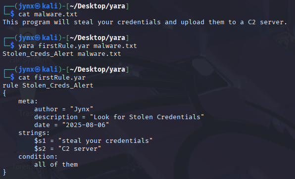

# YARA Rule(s) Documentation Card

## YARA Rule 1 [First YARA Rule]

| Field | Description |
| --- | --- |
| **Rule Name** | `Stolen_Creds_Alert` |
| **Author** | Jynx |
| **Date Created** | August 6, 2025 |
| **Version** | 4.5.2 |
| **Status** | **EXECUTED** |
| **File Targeted** | `malware.txt` |
| **Detection Goal** | Detect phrases suggesting credential theft and C2 exfiltration |

---

### Rule Code:

```
rule Stolen_Creds_Alert      # Rule name (must be unique)
{
    meta:                    # Metadata, not mandatory but good practice
        author = "Jynx"
        description = "Look for Stolen Credentials"
        date = "2025-08-06"

    strings:                 # String patterns to search
        $s1 = "steal your credentials"
        $s2 = "C2 server"

    condition:               # Detection logic
        all of them         # Both $s1 and $s2 must exist
}
```

---

### Logic Breakdown:

| Element | Meaning |
| --- | --- |
| `$s1`, `$s2` | Literal strings to match in a file |
| `all of them` | Only trigger if both `$s1` and `$s2` appear |
| `meta fields` | Help identify rule author/date/version |
| `Rule name` | Unique identifier for logging or tool output |

---

### Testing Matrix:



| Test File | Expected Result | Result |
| --- | --- | --- |
| `malware.txt` | Must Match | Matched |
| `clean.txt` | Should Not Match | No Match |
| `mod_malware.txt` | Should Not Match | No Match |


---

### Notes / Observations

- Rule is **string-based**, so won’t catch obfuscated or encoded variants
- Could add regex or hex strings for robustness
- Consider extracting C2 IPs/domains next time

## YARA Rule 2 [Mod Malware Detector]

| Field | Description |
| --- | --- |
| **Rule Name** | `User_Login_Data_Leaked` |
| **Author** | Jynx |
| **Date Created** | August 6, 2025 |
| **Version** | 4.5.2 |
| **Status** | **EXECUTED** |
| **File Targeted** | `mod_malware.txt` |
| **Detection Goal** | Detect obfuscated variations of login data exfiltration patterns |

---

### Rule Code:

```
bash
Copy code
rule User_Login_Data_Leaked
{
    meta:
        author = "Jynx"
        description = "Look for Stolen Credentials"
        date = "2025-08-06"
        version = "1.0"

    strings:
        $string1 = "exfiltrates user login data"
        $string2 = "exfiltrates user login username"
        $string3 = "exfiltrates user login password"
        $string4 = "exfiltrates user login details"
        $string5 = "exfiltrates user login credentials"

    condition:
        any of them
}
```

---

### Logic Breakdown:

| Element | Meaning |
| --- | --- |
| `$string1` to `$string5` | Fuzzy variations of exfiltration intent |
| `any of them` | Match if *at least one* string is found |
| `meta fields` | Track rule author, date, and version |
| `Rule name` | Unique identifier for this detection case |

---

### Testing Matrix:


| Test File | Expected Result | Result |
| --- | --- | --- |
| `mod_malware.txt` | Must Match | Matched |
| `malware.txt` | Should Not Match | No Match |
| `clean.txt` | Should Not Match | No Match |


---

### 📌 Notes / Observations

- Rule was designed for **fuzzier, disguised** malicious text (vs exact string match like Rule 1)
- All match strings start with `"exfiltrates user login..."` but vary the ending — a basic form of signature broadening
- Stronger detection could come from regex patterns or case-insensitive matching
