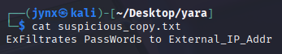

# YARA Rule(s) Documentation Card

# Challenge 1

## Challenge Log

| **Field** | Detail |
| --- | --- |
| **Case Title** | Exfiltration Detection via YARA + Regex |
| **Author** | Jynx |
| **Date** | August 7, 2025 |
| **Rule Set** | `suspicious_activity.yar` |
| **Environment** | YARA CLI v4.5.2 on Windows/Linux |
| **Test Directory** | `suspicious_copy.txt`  |
| **Detection Goal** | Identify only the exfiltrating payload |

## Rule Metadata

| Field | Value |
| --- | --- |
| **Rule Name** | `Suspicious_Copy_Activity` |
| **Version** | 1.0 |
| **Type** | Regex + Case-insensitive |
| **Detection Logic** | Find malicious use of `exfiltrate`, `pass*`, and `external IP` indicators |

## Logic Breakdown

| Element | Role |
| --- | --- |
| `\s+` | Matches multiple space/tab/newline variants |
| `(words | data |
| `[_-]?` | Matches both underscore or dash between `external` and `ip` |
| `(_addr)?` | Optional addition — matches `ip` or `ip_addr` |
| `nocase` | Enables catching `ExFilTrAtEs`, `PASSDATA`, etc. |

## Testing Matrix

| Filename | Expected Result | Actual Result |
| --- | --- | --- |
| backup_script.txt | Should NOT Match | ❌ |
| clean.txt | Should NOT Match | ❌ |
| malware.txt | Should NOT Match | ❌ |
| mod_malware.txt | Should NOT Match | ❌ |
| suspicious_copy.txt | Must Match | ✅ Matched |

## Observations

### False Positive Check

All clean decoys passed with no alerts.

The rule did not trigger on backup scripts, heartbeat logs, or config checkers.

### Observations and Insights:

- Regex-based YARA is far more flexible than strict string matching
- Carefully tuned `condition: all of them` improved signal-to-noise
- Could add byte-based matching for future PE or memory dump detection
- Consider tuning for obfuscation-resistant indicators in next version

# Challenge 2

## Challenge Log

| **Field** | Detail |
| --- | --- |
| **Case Title** | Exfiltration Detection via YARA + Regex |
| **Author** | Jynx |
| **Date** | August 7, 2025 |
| **Rule Set** | `catch_malware.yar` |
| **Environment** | YARA CLI v4.5.2 on Windows/Linux |
| **Test Directory** | `script_drops/` (25 Python scripts) |
| **Detection Goal** | Identify 1 exfiltrating payload in a field of decoys |

## Rule Metadata

| Field | Value |
| --- | --- |
| **Rule Name** | `Suspicious_Copy_Activity` |
| **Version** | 1.0 |
| **Type** | Regex + Case-insensitive |
| **Detection Logic** | Find malicious use of `exfiltrate`, `socket`, and `stolen credentials` indicators |

## Logic Breakdown

| Element | Purpose |
| --- | --- |
| `$s1 = /exfiltrate/ nocase` | Matches function names or keywords like `exfiltrate()` — common in malware exfil routines. Case-insensitive to catch variations like `Exfiltrate`, `EXFILTRATE`, etc. |
| `$s2 = /socket\.socket/ nocase` | Looks for Python socket constructor `socket.socket` — often used to establish outbound connections. The `.` is escaped with `\.` to match literally, not any character. |
| `$s3 = /stolen credentials/ nocase` | Matches exact phrase “stolen credentials” — a classic payload or debug string seen in basic exfil/test malware scripts. |
| `condition: all of them` | Rule only triggers if **all 3 strings** are present in the file — tightens detection, reduces false positives. |

## Testing Matrix

| Filename | Expected Result | Actual Result |
| --- | --- | --- |
| `script_00.py` | No Match | ❌ |
| `script_01.py` | No Match | ❌ |
| `script_02.py` | No Match | ❌ |
| `script_03.py` | No Match | ❌ |
| `script_04.py` | No Match | ❌ |
| `script_05.py` | No Match | ❌ |
| `script_06.py` | No Match | ❌ |
| `script_07.py` | No Match | ❌ |
| `script_08.py` | No Match | ❌ |
| `script_09.py` | No Match | ❌ |
| `script_10.py` | No Match | ❌ |
| `script_11.py` | No Match | ❌ |
| `script_12.py` | No Match | ❌ |
| `script_13.py` | No Match | ❌ |
| `script_14.py` | No Match | ❌ |
| `script_15.py` | No Match | ❌ |
| `script_16.py` | Must Match | ✅ Matched |
| `script_17.py` | No Match | ❌ |
| `script_18.py` | No Match | ❌ |
| `script_19.py` | Match | ❌ |
| `script_20.py` | Match | ❌ |
| `script_21.py` | Match | ❌ |
| `script_22.py` | No Match | ❌ |
| `script_23.py` | No Match | ❌ |
| `script_24.py` | No Match | ❌ |

## Observations

### False Positive Check

All clean decoys passed with no alerts.

The rule did not trigger on backup scripts, heartbeat logs, or config checkers.

### Observations and Insights:

- Regex-based YARA is far more flexible than strict string matching
- Carefully tuned `condition: all of them` improved signal-to-noise
- Could add byte-based matching for future PE or memory dump detection
- Consider tuning for obfuscation-resistant indicators in next version
