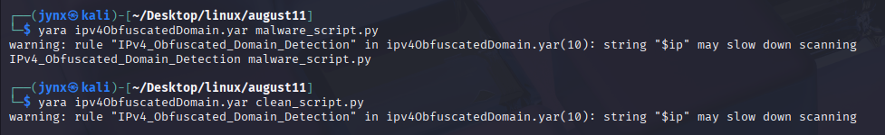

# IPv4 & Obfuscated Domain Detection

📅**Date:** August 11, 2025

| Field | Description |
| --- | --- |
| **Rule Name** | `IPv4_Obfuscated_Domain_Detection` |
| **Author** | Jynx |
| **Date Created** | August 11, 2025 |
| **Version** | 4.5.2 |
| **Status** | **TESTED** |
| **Target Files** | `malware_script.py`, `clean_script.py` |
| **Detection Goal** | Detect presence of hardcoded IPv4 addresses and obfuscated domains in code (e.g., `evil[.]com`). |

---

### **Rule Code**

```bash
rule IPv4_Obfuscated_Domain_Detection
{
    meta:
        author = "Jynx"
        description = "Detects hardcoded IPv4 and obfuscated domains like evil[.]com"
        date = "2025-08-11"
        version = "4.5.2"

    strings:
        $ip = /([0-9]{1,3}\.){3}[0-9]{1,3}/ nocase
        $domain = /[a-zA-Z0-9]+\[\.\][a-zA-Z]{2,}/ nocase

    condition:
        all of them
}
```

---

### Findings




---

### **Logic Breakdown**

| Element | Meaning |
| --- | --- |
| `$ip` | Matches IPv4 addresses with each octet being 1–3 digits |
| `$domain` | Matches obfuscated domains of the form `name[.]tld` |
| `nocase` | Makes both matches case-insensitive |
| `all of them` | Both `$ip` and `$domain` must be present in the same file for a match |

---

### **Test Results**

| Test File | Expected Result | Actual Result |
| --- | --- | --- |
| `malware_script.py` | Match | Match |
| `clean_script.py` (with false-positive traps) | No Match | No Match |

---

### **Notes & Observations**

- **Warning:** `$ip` pattern may slow scanning on large datasets due to nested repetition — not an issue in our small tests.
- Learned that YARA regex doesn’t support `\d` or `\b`, and requires `[0-9]` and explicit ranges.
- False-positive traps (`999.999.10` and `file[.]config`) successfully ignored.
- Syntax errors earlier today came from unsupported escape sequences and needing to place `nocase` outside regex delimiters.

---

📌 **Acknowledgement:** Today’s drill built on foundational regex/YARA concepts and debugging, not flashy output — but critical for real-world DFIR readiness.
