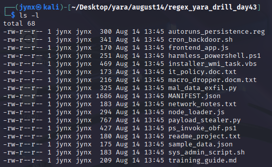

# DFIR Regex + YARA Hunt + Python Automation

## YARA-Scan: Detection Rule Development

- **Day:** **`14th August, 2025`**
- **Analyst:** **`Jynx`**
- **Dataset path:** **`~/Desktop/yara/august14/regex_yara_drill_day43`**
- **Primary Objective:** To demonstrate proficiency in creating effective YARA signatures through systematic regex implementation and testing methodologies.
- **Success Criteria:**

---

## Environment

| Item | Value |
| --- | --- |
| Host / OS | **`6.12.25-1kali1 x86_64`** |
| YARA version | **`4.5.2`** |
| Shell | **`/bin/bash`** |

### 17 Files [.zip] —unzipped:



---

## Findings and Suspicious evidences:

### File 1

| File Name | Size  | Finding |
| --- | --- | --- |
| **`autoruns_persistence.reg`** | 300 Bytes | **Suspicious** |


- **`OneDrive Update` Run Key** → Legitimate-looking name masking malicious DLL execution at user logon. DLL located in a public folder, which is unusual for system libraries.
- **`FakeDrv` Kernel Driver** → Non-standard driver path and suspicious name; drivers run in kernel mode, making them powerful tools for attackers.

### Regex:


### File 2

| File Name | Size  | Finding |
| --- | --- | --- |
| **`cron_backdoor.sh`** | 341 Bytes | **Suspicious** |


- **`@reboot`** → This cron syntax runs the command every time the system starts.
- **Hidden Path** → `/opt/.cache/.update.py` looks like a cache file, but it’s actually an executable Python script — common attacker obfuscation to blend in with benign system cache files.
- Hexadecimal notation for an IP address → evades naive string searches for `192.168.*`.
- This is a **local network IP**, could indicate lateral movement testing or staging.
- Often used to check connectivity to the C2 or as a *signal* that the implant is active.
- Output is suppressed to avoid tipping off a system admin watching logs.

### Regex:


### File 3

| File Name | Size  | Finding |
| --- | --- | --- |
| **`installer_wmi_task.vbs`** | 469 Bytes | **Suspicious** |


• WMI event subscriptions are a **known persistence mechanism** — attackers can trigger scripts on specific system events without dropping files in normal startup locations.

- The `bad[.]updates` domain and unusual private IP could still be **C2 infrastructure** placeholders.
- `[.]` is a common trick to break automatic URL linking in docs — used in malware reports and sometimes in the malware itself.

Even with commands commented out, this script **documents persistence techniques and C2 IOCs:**

- It might be **activated later** by removing the comment marker.
- It could be **part of attacker tooling** or a template.
- It contains **direct IOCs** (domain & IP).

### Regex:


### File 4

| File Name | Size  | Finding |
| --- | --- | --- |
| **`macro_dropper.docm.txt`** | 216 Bytes | **Suspicious** |


- Remote template injection → Word will attempt to fetch this `.dotm` file from a C2 server.
- Obfuscation with `hxxp` and `[.]` is a common technique to avoid automatic URL linking and bypass simple scanners.
- DLL dropped in a public directory — accessible to all users and sometimes loaded automatically by legitimate processes.
- Path choice suggests staging for later execution.

### Regex:


### File 5

| File Name | Size  | Finding |
| --- | --- | --- |
| **`mal_data_exfil.py`** | 325 Bytes | **Suspicious** |


- `base64` → commonly used to **encode stolen data** before sending to C2.
- `requests` → used for outbound HTTP exfiltration.
- **Domain + IP** → attacker infrastructure (obfuscated with `[.]` to avoid auto-linking).
- Private IP might indicate a **staging server** inside the compromised network.
- `harvested_tokens` is clearly sensitive data — encoding is typical to bypass inspection.
- Splitting `"exfiltrate"` into multiple string fragments is a **keyword evasion tactic** to bypass naïve string detection.

### Regex:


### File 6

| File Name | Size  | Finding |
| --- | --- | --- |
| **`node_loader.js`** | 294 Bytes | **Suspicious** |


- Connects to an external "attacker" domain
- Uses obfuscation with `[dot]` to hide the real domain
- Establishes a beacon pattern typical of malware
- The `steal()` function simulates credential theft
- Returns sensitive data as a Buffer (common in malware)
- Establishes outbound connections to suspicious domains
- Uses non-standard ports (8080) for communication
- Implements beacon-like behavior for persistent communication

### Regex:


### File 7

| File Name | Size  | Finding |
| --- | --- | --- |
| **`payload_stealer.py`** | 767 Bytes | **Suspicious** |


- `collect()` function simulates stealing login credentials
- Hardcoded example credentials (`user=lab;pass=lab123`)
- Encodes stolen data for transmission
- Socket connection to external "evil" domain
- Uses common malware port (4444)
- Attempts to send stolen credentials over network
- Creates a fake DLL file (`uxtheme.dll`)
- Writes PE header bytes (`MZ\x90\x00\x03\x00`) to mimic legitimate Windows executables
- This simulates malware dropping additional payloads
- Domain/IP obfuscation with brackets (`evil[.]com`, `192[.]168[.]1[.]10`)
- Beacon string construction to avoid static detection
- Intentionally broken network code to prevent actual execution

### Regex:


### File 8

| File Name | Size  | Finding |
| --- | --- | --- |
| **`ps_invoke_obf.ps1`** | 427 Bytes | **Suspicious** |


- Encodes commands in Base64 to evade static detection
- `$b64 = "V3JpdGUtT3V0cHV0ICJoZWFydGJlYXQi"` decodes to `Write-Output "heartbeat"`
- Common technique to hide malicious PowerShell commands
- Uses `[System.Convert]::FromBase64String()` to decode at runtime
- Executes decoded commands dynamically to avoid signature detection
- Pattern typical of fileless malware
- References `certutil` for malicious downloads (commented out)
- Uses `rundll32.exe` for DLL execution
- These are legitimate Windows tools often abused by attackers
- Obfuscated domain (`update[dot]server[dot]local`)

### Regex:


---

## YARA output w/CODE:

```bash
rule Obfuscated_dll_URL_IoC
{
        meta:
                author = "Jynx"
                description = "Catch Obfsucated and persisting DLL."
        strings:
                $dll_path = /\w*\.?\w*\s\\\\\?\\\w?\W?\\\\\w*\\\\\w*\\\\[A-Za-z0-9_-]
						                +\.?\w*/ nocase
        condition:
                $dll_path
}

rule Cron_Reboot_Persistence
{
        meta:
                author = "Jynx"
                description = "Detect cron @reboot persistence entries."
        strings:
                $cron_entry = /@reboot/  nocase
                $hidden_py  = /@reboot\s+\/\w+\/\w+\/\w+\s+\/\w+\/\.\w+\/\.\w+\.py/ 
							                nocase
        condition:
                all of them
}

rule Obfuscated_Domain_and_Hex_IP
{
    meta:
        author = "Jynx"
        description = "Detect obfuscated domains with [.] and 
							        hexadecimal-formatted IPv4 addresses"
    strings:
        $obf_domain1 = /\w+\[\.\]\w+\.(org|com|net|edu|gov|\w{1,4})/ nocase
        $obf_domain2 = /\w+(dot)\w+\.(org|com|net|edu|gov|\w{1,4})/ nocase  
        $obf_domain3 = /\w+\[dot\]\w+\.(org|com|net|edu|gov|\w{1,4})/ nocase
        $hex_ip      = /0x[0-9a-f]{1,2}\.0x[0-9a-f]{1,2}\.0x[0-9a-f]{1,2}\.0x[0-9a-f]
								        {1,2}/ nocase
        $obf_domain  = /[a-zA-Z]+\[\.\][a-zA-Z]+/ nocase
        $obf_ip      = /[0-9]{1,3}\[\.\][0-9]{1,3}\[\.\][0-9]{1,3}\[\.\][0-9]{1,3}/ 
								        nocase
        $obf_ip2     = /[0-9]{3}\s+\[\.\]\s+[0-9]{3}\s+\[\.\]\s+[0-9]{2}\s+\[\.\]\s+
								        [0-9]{2}/ nocase
    condition:
        any of them
}

rule Obfuscated_URL
{
    meta:
        author = "Jynx"
        description = "Detect obfuscated URLs [hxxp] and likes."
    strings:
        $obf_url    = /hxxps?:\/\/[a-zA-Z]+\[\.\][a-zA-Z]+\/[a-zA-Z]+\.[a-zA-Z]+/ nocase
        $obf_url2   = /http:\/\/[a-zA-Z]+\.[a-zA-Z]+\/[a-zA-Z]+/ nocase 
        $path       = /C:\\[a-zA-Z]+\\[a-zA-Z]+\\[a-zA-Z]+\\[a-zA-Z]+\.dll/ nocase
        $print_text = /print\s*\(\s*"exf"\s*,\s*"i"\s*\+\s*"ltr"\s*\+\s*"ate"\s*\)/
    condition:
        any of them
}

rule obfuscated_host_beacon_socket
{
        meta:
                AUTHOR = "Jynx"
                DESCRIPTION = "Exfiltrate obfuscated host, beacon and socket from C2 
                Communication."
        strings:
                $host = /[a-zA-Z]+\[dot\][a-zA-Z]+/ nocase
                $beacon = /"c2:\/\/"\s*\+\s*\w+\.replace\s*\(\s*"\[dot\]"\s*,
                \s*"\."\s*\)\s*\+\s*":\d+"/ nocase
        condition:
                any of them
}

```

```bash
┌──(jynx㉿kali)-[~/Desktop/yara/august15]
└─$ yara -r -s iocRules.yara ./regex_yara_drill_day43
Obfuscated_Domain_and_Hex_IP ./regex_yara_drill_day43/ps_invoke_obf.ps1
0x131:$obf_domain: evil[.]com
0x132:$obf_domain: vil[.]com
0x133:$obf_domain: il[.]com
0x134:$obf_domain: l[.]com
obfuscated_host_beacon_socket ./regex_yara_drill_day43/ps_invoke_obf.ps1
0x17c:$host: update[dot]server
0x17d:$host: pdate[dot]server
0x17e:$host: date[dot]server
0x17f:$host: ate[dot]server
0x180:$host: te[dot]server
0x181:$host: e[dot]server
0x187:$host: server[dot]local
0x188:$host: erver[dot]local
0x189:$host: rver[dot]local
0x18a:$host: ver[dot]local
0x18b:$host: er[dot]local
0x18c:$host: r[dot]local
Obfuscated_Domain_and_Hex_IP ./regex_yara_drill_day43/it_policy.doc.txt
0x8b:$obf_domain: attacker[.]example
0x8c:$obf_domain: ttacker[.]example
0x8d:$obf_domain: tacker[.]example
0x8e:$obf_domain: acker[.]example
0x8f:$obf_domain: cker[.]example
0x90:$obf_domain: ker[.]example
0x91:$obf_domain: er[.]example
0x92:$obf_domain: r[.]example
Obfuscated_Domain_and_Hex_IP ./regex_yara_drill_day43/payload_stealer.py
0xf2:$obf_domain: evil[.]com
0xf3:$obf_domain: vil[.]com
0xf4:$obf_domain: il[.]com
0xf5:$obf_domain: l[.]com
0x108:$obf_ip: 192[.]168[.]1[.]10
0x109:$obf_ip: 92[.]168[.]1[.]10
0x10a:$obf_ip: 2[.]168[.]1[.]10
Cron_Reboot_Persistence ./regex_yara_drill_day43/cron_backdoor.sh
0x3f:$cron_entry: @reboot
0x3f:$hidden_py: @reboot /usr/bin/python3 /opt/.cache/.update.py
Obfuscated_Domain_and_Hex_IP ./regex_yara_drill_day43/cron_backdoor.sh
0x78:$hex_ip: 0xc0.0xa8.0x01.0x0a
0xaa:$obf_domain: attacker[.]org
0xab:$obf_domain: ttacker[.]org
0xac:$obf_domain: tacker[.]org
0xad:$obf_domain: acker[.]org
0xae:$obf_domain: cker[.]org
0xaf:$obf_domain: ker[.]org
0xb0:$obf_domain: er[.]org
0xb1:$obf_domain: r[.]org
0x136:$obf_domain: attacker[.]org
0x137:$obf_domain: ttacker[.]org
0x138:$obf_domain: tacker[.]org
0x139:$obf_domain: acker[.]org
0x13a:$obf_domain: cker[.]org
0x13b:$obf_domain: ker[.]org
0x13c:$obf_domain: er[.]org
0x13d:$obf_domain: r[.]org
Obfuscated_Domain_and_Hex_IP ./regex_yara_drill_day43/installer_wmi_task.vbs
0x1af:$obf_domain: bad[.]updates
0x1b0:$obf_domain: ad[.]updates
0x1b1:$obf_domain: d[.]updates
0x1c4:$obf_ip: 10[.]0[.]0[.]66
0x1c5:$obf_ip: 0[.]0[.]0[.]66
Obfuscated_dll_URL_IoC ./regex_yara_drill_day43/autoruns_persistence.reg
0x7c:$dll_path: rundll32.exe \\?\C:\\Users\\Public\\msdfa.dll
0x7d:$dll_path: undll32.exe \\?\C:\\Users\\Public\\msdfa.dll
0x7e:$dll_path: ndll32.exe \\?\C:\\Users\\Public\\msdfa.dll
0x7f:$dll_path: dll32.exe \\?\C:\\Users\\Public\\msdfa.dll
0x80:$dll_path: ll32.exe \\?\C:\\Users\\Public\\msdfa.dll
0x81:$dll_path: l32.exe \\?\C:\\Users\\Public\\msdfa.dll
0x82:$dll_path: 32.exe \\?\C:\\Users\\Public\\msdfa.dll
0x83:$dll_path: 2.exe \\?\C:\\Users\\Public\\msdfa.dll
0x84:$dll_path: .exe \\?\C:\\Users\\Public\\msdfa.dll
0x85:$dll_path: exe \\?\C:\\Users\\Public\\msdfa.dll
0x86:$dll_path: xe \\?\C:\\Users\\Public\\msdfa.dll
0x87:$dll_path: e \\?\C:\\Users\\Public\\msdfa.dll
0x88:$dll_path:  \\?\C:\\Users\\Public\\msdfa.dll
Obfuscated_Domain_and_Hex_IP ./regex_yara_drill_day43/macro_dropper.docm.txt
0x54:$obf_domain: evil[.]com
0x55:$obf_domain: vil[.]com
0x56:$obf_domain: il[.]com
0x57:$obf_domain: l[.]com
Obfuscated_URL ./regex_yara_drill_day43/macro_dropper.docm.txt
0x4d:$obf_url: hxxp://evil[.]com/template.dotm
0xb4:$path: C:\Users\Public\Documents\msdfa.dll
Obfuscated_Domain_and_Hex_IP ./regex_yara_drill_day43/network_notes.txt
0x1b:$obf_domain: example[.]com
0x1c:$obf_domain: xample[.]com
0x1d:$obf_domain: ample[.]com
0x1e:$obf_domain: mple[.]com
0x1f:$obf_domain: ple[.]com
0x20:$obf_domain: le[.]com
0x21:$obf_domain: e[.]com
0x5d:$obf_ip: 192[.]168[.]0[.]1
0x5e:$obf_ip: 92[.]168[.]0[.]1
0x5f:$obf_ip: 2[.]168[.]0[.]1
0x72:$obf_ip: 192[.]168[.]0[.]254
0x73:$obf_ip: 92[.]168[.]0[.]254
0x74:$obf_ip: 2[.]168[.]0[.]254
obfuscated_host_beacon_socket ./regex_yara_drill_day43/sys_admin_script.sh
0x6c:$host: update[dot]server
0x6d:$host: pdate[dot]server
0x6e:$host: date[dot]server
0x6f:$host: ate[dot]server
0x70:$host: te[dot]server
0x71:$host: e[dot]server
0x77:$host: server[dot]local
0x78:$host: erver[dot]local
0x79:$host: rver[dot]local
0x7a:$host: ver[dot]local
0x7b:$host: er[dot]local
0x7c:$host: r[dot]local
Obfuscated_Domain_and_Hex_IP ./regex_yara_drill_day43/training_guide.md
0x80:$obf_ip: 203[.]0[.]113[.]5
0x81:$obf_ip: 03[.]0[.]113[.]5
0x82:$obf_ip: 3[.]0[.]113[.]5
obfuscated_host_beacon_socket ./regex_yara_drill_day43/training_guide.md
0x48:$host: contoso[dot]com
0x49:$host: ontoso[dot]com
0x4a:$host: ntoso[dot]com
0x4b:$host: toso[dot]com
0x4c:$host: oso[dot]com
0x4d:$host: so[dot]com
0x4e:$host: o[dot]com
Obfuscated_Domain_and_Hex_IP ./regex_yara_drill_day43/sample_data.json
0x99:$obf_ip: 198[.]51[.]100[.]10
0x9a:$obf_ip: 98[.]51[.]100[.]10
0x9b:$obf_ip: 8[.]51[.]100[.]10
obfuscated_host_beacon_socket ./regex_yara_drill_day43/sample_data.json
0x7c:$host: docs[dot]internal
0x7d:$host: ocs[dot]internal
0x7e:$host: cs[dot]internal
0x7f:$host: s[dot]internal
Obfuscated_Domain_and_Hex_IP ./regex_yara_drill_day43/mal_data_exfil.py
0x4b:$obf_domain: EVIL[.]NET
0x4c:$obf_domain: VIL[.]NET
0x4d:$obf_domain: IL[.]NET
0x4e:$obf_domain: L[.]NET
0x5d:$obf_ip2: 192 [.] 168 [.] 50 [.] 25
Obfuscated_URL ./regex_yara_drill_day43/mal_data_exfil.py
0xe3:$obf_url2: http://evil.net/upload
0x112:$print_text: print("exf", "i" + "ltr" + "ate")
obfuscated_host_beacon_socket ./regex_yara_drill_day43/node_loader.js
0x56:$host: attacker[dot]org
0x57:$host: ttacker[dot]org
0x58:$host: tacker[dot]org
0x59:$host: acker[dot]org
0x5a:$host: cker[dot]org
0x5b:$host: ker[dot]org
0x5c:$host: er[dot]org
0x5d:$host: r[dot]org
0x78:$beacon: "c2://" + host.replace("[dot]", ".") + ":8080"
```

## Conclusion:

The rulebook excelled in detecting various obfuscation techniques across diverse file formats:

**`Obfuscated_Domain_and_Hex_IP` Rule:**

- Successfully identified bracket-notation domain obfuscation (`evil[.]com`, `attacker[.]example`)
- Detected hexadecimal IP address formats (`0xc0.0xa8.0x01.0x0a`)
- Caught spaced bracket notation (`192 [.] 168 [.] 50 [.] 25`)
- Worked across multiple file types: PowerShell scripts, Python files, shell scripts, VBS files, and text documents

**`obfuscated_host_beacon_socket` Rule:**

- Effectively captured C2 communication patterns using `[dot]` notation
- Identified beacon construction patterns in JavaScript (`"c2://" + host.replace("[dot]", ".") + ":8080"`)
- Detected various host obfuscation formats across different programming languages

**Specialized Rules Performance:**

- **`Cron_Reboot_Persistence`:** Successfully identified persistence mechanisms in shell scripts
- **`Obfuscated_dll_URL_IoC`:** Caught DLL persistence paths in registry files
- **`Obfuscated_URL`:** Detected both `hxxp://` obfuscation and suspicious file paths

### Legitimate Infrastructure Detections [False Positive Analysis]

The rules triggered on several samples that appear to contain legitimate or training content:

1. **`network_notes.txt`** - Triggered on `example[.]com` and local network ranges (`192[.]168[.]0[.]1`)
2. **`training_guide.md`** - Detected `contoso[dot]com` (Microsoft's example domain) and documentation IPs
3. **`sample_data.json`** - Flagged test data containing `docs[dot]internal`

### Root Causes of False Positives

**Overly Broad Pattern Matching:**

- The `$obf_domain` pattern `/[a-zA-Z]+\[\.\][a-zA-Z]+/` catches legitimate security training materials
- Documentation and educational content often use bracket notation to defang URLs
- Test data and configuration examples frequently employ these same obfuscation patterns

**Context Insensitivity:**

- Rules lack context awareness to distinguish between malicious payloads and educational content
- No differentiation between active threats and security awareness materials

### Comprehensive Coverage

- **Multi-language support:** Rules work across PowerShell, Python, VBS, JavaScript, shell scripts, and configuration files
- **Flexible pattern matching:** Effective use of regex to catch variations and evasion attempts
- **Layered detection:** Multiple rules complement each other to catch different aspects of attacks

### Robust Regex Implementation

- **Case insensitivity:** `/nocase` flag ensures detection regardless of case variations
- **Flexible quantifiers:** Patterns accommodate various string lengths and formats
- **Character class usage:** Proper balance between specificity and flexibility

### Areas for Improvement

**Whitelist Integration:**

- Implement known-good domain exclusions (contoso.com, example.com, test domains)
- Add file path context analysis to reduce training material false positives

**Precision Tuning:**

- Narrow IP range patterns to exclude common RFC 1918 ranges in documentation
- Enhance DLL path detection to focus on suspicious locations rather than all DLL references

### Technical Insights

**Pattern Recognition Mastery:**

- Gained deep understanding of how attackers obfuscate IoCs across different file types
- Developed appreciation for the balance between detection coverage and precision
- Learned the importance of context in threat detection rules

**Regex Expertise:**

- Advanced regex skills for handling complex obfuscation patterns
- Understanding of quantifier optimization for performance
- Experience with character classes for flexible matching

**Multi-Format Analysis:**

- Exposure to threat indicators across diverse file formats (PS1, PY, VBS, SH, REG, DOCM, JSON, MD)
- Understanding of how the same obfuscation techniques manifest differently across languages

**False Positive Management:**
The exercise highlighted the critical balance between comprehensive threat detection and operational efficiency. High false positive rates can lead to:

- Alert fatigue among security analysts
- Reduced confidence in detection systems
- Increased investigation overhead

**Rule Development Lifecycle:**

- Initial broad detection patterns for maximum coverage
- Iterative refinement based on false positive analysis
- Continuous tuning based on environmental context

## Python Automation

### Python Script:

```python
import re
import os
from datetime import datetime

def extract_iocs_from_folder():
    folder_name = input("Enter folder name (in same directory): ")
    
    if not os.path.exists(folder_name):
        print(f"Error: Folder '{folder_name}' not found.")
        return
    
    # YARA rule patterns converted to Python regex (based on your iocRules.yara)
    patterns = {
        "Obfuscated_DLL_URL": re.compile(r'\w*\.?\w*\s\\\\\?\\\w?\W?\\\\\w*\\\\\w*\\\\[A-Za-z0-9_-]+\.?\w*', re.IGNORECASE),
        
        "Cron_Reboot_Persistence": re.compile(r'@reboot', re.IGNORECASE),
        "Hidden_Python_Cron": re.compile(r'@reboot\s+\/\w+\/\w+\/\w+\s+\/\w+\/\.\w+\/\.\w+\.py', re.IGNORECASE),
        
        "Obfuscated_Domain_Bracket": re.compile(r'\w+\[\.\]\w+\.(org|com|net|edu|gov|\w{1,4})', re.IGNORECASE),
        "Obfuscated_Domain_Dot": re.compile(r'\w+(dot)\w+\.(org|com|net|edu|gov|\w{1,4})', re.IGNORECASE),
        "Obfuscated_Domain_Bracket_Dot": re.compile(r'\w+\[dot\]\w+\.(org|com|net|edu|gov|\w{1,4})', re.IGNORECASE),
        "Hex_IP_Address": re.compile(r'0x[0-9a-f]{1,2}\.0x[0-9a-f]{1,2}\.0x[0-9a-f]{1,2}\.0x[0-9a-f]{1,2}', re.IGNORECASE),
        "Obfuscated_Domain_Simple": re.compile(r'[a-zA-Z]+\[\.\][a-zA-Z]+', re.IGNORECASE),
        "Obfuscated_IP_Bracket": re.compile(r'[0-9]{1,3}\[\.\][0-9]{1,3}\[\.\][0-9]{1,3}\[\.\][0-9]{1,3}', re.IGNORECASE),
        "Obfuscated_IP_Spaced": re.compile(r'[0-9]{3}\s+\[\.\]\s+[0-9]{3}\s+\[\.\]\s+[0-9]{2}\s+\[\.\]\s+[0-9]{2}', re.IGNORECASE),
        
        "Obfuscated_HTTPS_URL": re.compile(r'hxxps?:\/\/[a-zA-Z]+\[\.\][a-zA-Z]+\/[a-zA-Z]+\.[a-zA-Z]+', re.IGNORECASE),
        "HTTP_URL": re.compile(r'http:\/\/[a-zA-Z]+\.[a-zA-Z]+\/[a-zA-Z]+', re.IGNORECASE),
        "DLL_Path": re.compile(r'C:\\[a-zA-Z]+\\[a-zA-Z]+\\[a-zA-Z]+\\[a-zA-Z]+\.dll', re.IGNORECASE),
        "Obfuscated_Print": re.compile(r'print\s*\(\s*"exf"\s*,\s*"i"\s*\+\s*"ltr"\s*\+\s*"ate"\s*\)', re.IGNORECASE),
        
        "Host_Dot_Obfuscated": re.compile(r'[a-zA-Z]+\[dot\][a-zA-Z]+', re.IGNORECASE),
        "C2_Beacon_Socket": re.compile(r'"c2:\/\/"\s*\+\s*\w+\.replace\s*\(\s*"\[dot\]"\s*,\s*"\."\s*\)\s*\+\s*":\d+"', re.IGNORECASE)
    }
    
    all_iocs = {}
    total_files_scanned = 0
    
    print(f"\nScanning folder: {folder_name}")
    print("=" * 50)
    
    # Scan all files in the folder
    for filename in os.listdir(folder_name):
        file_path = os.path.join(folder_name, filename)
        
        if os.path.isfile(file_path):
            total_files_scanned += 1
            print(f"Scanning: {filename}")
            
            try:
                with open(file_path, "r", errors="ignore", encoding="utf-8") as f:
                    content = f.read()
                
                # Check each pattern against file content
                for pattern_name, pattern in patterns.items():
                    matches = pattern.findall(content)
                    if matches:
                        if pattern_name not in all_iocs:
                            all_iocs[pattern_name] = []
                        all_iocs[pattern_name].extend(matches)
                        
            except Exception as e:
                print(f"  Error reading {filename}: {e}")
    
    # Process and display results
    if all_iocs:
        print(f"\n" + "=" * 60)
        print(f"IoC EXTRACTION RESULTS FROM {folder_name.upper()}")
        print("=" * 60)
        print(f"Files scanned: {total_files_scanned}")
        
        total_iocs = 0
        unique_iocs = {}
        
        for pattern_name, matches in all_iocs.items():
            unique_matches = sorted(set(matches))
            unique_iocs[pattern_name] = unique_matches
            total_iocs += len(matches)
            
            print(f"\n[{pattern_name}]")
            print(f"  Total matches: {len(matches)}")
            print(f"  Unique matches: {len(unique_matches)}")
            for match in unique_matches:
                print(f"    {match}")
        
        print(f"\nSUMMARY:")
        print(f"  Total IoCs found: {total_iocs}")
        print(f"  Unique IoC types: {len(unique_iocs)}")
        
        # Save results to file
        output_file = "IoCs_Found.txt"
        with open(output_file, "a", encoding="utf-8") as out:
            out.write("\n" + "=" * 70 + "\n")
            out.write(f"IoC Extraction Results from folder: {folder_name}\n")
            out.write(f"Scan Date: {datetime.now().strftime('%Y-%m-%d %H:%M:%S')}\n")
            out.write(f"Files Scanned: {total_files_scanned}\n")
            out.write(f"Total IoCs Found: {total_iocs}\n")
            out.write("=" * 70 + "\n\n")
            
            for pattern_name, unique_matches in unique_iocs.items():
                out.write(f"[{pattern_name}] - {len(unique_matches)} unique matches:\n")
                for match in unique_matches:
                    out.write(f"  {match}\n")
                out.write("\n")
            
            out.write("=" * 70 + "\n\n")
        
        print(f"\nResults saved to {output_file}")
        
    else:
        print(f"\nNo IoCs found in {folder_name} based on YARA rules.")
        print(f"Files scanned: {total_files_scanned}")

def show_supported_patterns():
    print("\nSupported IoC Patterns (from your iocRules.yara):")
    print("=" * 50)
    patterns_info = [
        "1. Obfuscated DLL URLs and paths",
        "2. Cron @reboot persistence entries", 
        "3. Hidden Python cron jobs",
        "4. Obfuscated domains ([.] and [dot] formats)",
        "5. Hexadecimal IP addresses",
        "6. Obfuscated IP addresses with brackets",
        "7. Obfuscated URLs (hxxp/hxxps)",
        "8. HTTP URLs and DLL paths",
        "9. Obfuscated print statements",
        "10. C2 beacon and socket communications"
    ]
    
    for info in patterns_info:
        print(f"  {info}")

if __name__ == "__main__":
    print("YARA-based IoC Extractor")
    print("========================")
    print("This script scans files in a folder using YARA rule patterns")
    
    choice = input("\nDo you want to see supported patterns first? (y/n): ").lower()
    if choice == 'y':
        show_supported_patterns()
        input("\nPress Enter to continue...")
    
    extract_iocs_from_folder()

```

### Output File [IoCs_Found.txt]

```bash
======================================================================
IoC Extraction Results from folder: regex_yara_drill_day43
Scan Date: 2025-08-17 21:26:09
Files Scanned: 17
Total IoCs Found: 30
======================================================================

[Obfuscated_DLL_URL] - 1 unique matches:
  rundll32.exe \\?\C:\\Users\\Public\\msdfa.dll

[Host_Dot_Obfuscated] - 4 unique matches:
  attacker[dot]org
  contoso[dot]com
  docs[dot]internal
  update[dot]server

[C2_Beacon_Socket] - 1 unique matches:
  "c2://" + host.replace("[dot]", ".") + ":8080"

[Obfuscated_Domain_Simple] - 6 unique matches:
  EVIL[.]NET
  attacker[.]example
  attacker[.]org
  bad[.]updates
  evil[.]com
  example[.]com

[Obfuscated_IP_Bracket] - 6 unique matches:
  10[.]0[.]0[.]66
  192[.]168[.]0[.]1
  192[.]168[.]0[.]254
  192[.]168[.]1[.]10
  198[.]51[.]100[.]10
  203[.]0[.]113[.]5

[Obfuscated_HTTPS_URL] - 1 unique matches:
  hxxp://evil[.]com/template.dotm

[DLL_Path] - 1 unique matches:
  C:\Users\Public\Documents\msdfa.dll

[Obfuscated_IP_Spaced] - 1 unique matches:
  192 [.] 168 [.] 50 [.] 25

[HTTP_URL] - 1 unique matches:
  http://evil.net/upload

[Obfuscated_Print] - 1 unique matches:
  print("exf", "i" + "ltr" + "ate")

[Cron_Reboot_Persistence] - 1 unique matches:
  @reboot

[Hidden_Python_Cron] - 1 unique matches:
  @reboot /usr/bin/python3 /opt/.cache/.update.py

[Hex_IP_Address] - 1 unique matches:
  0xc0.0xa8.0x01.0x0a

======================================================================
```
